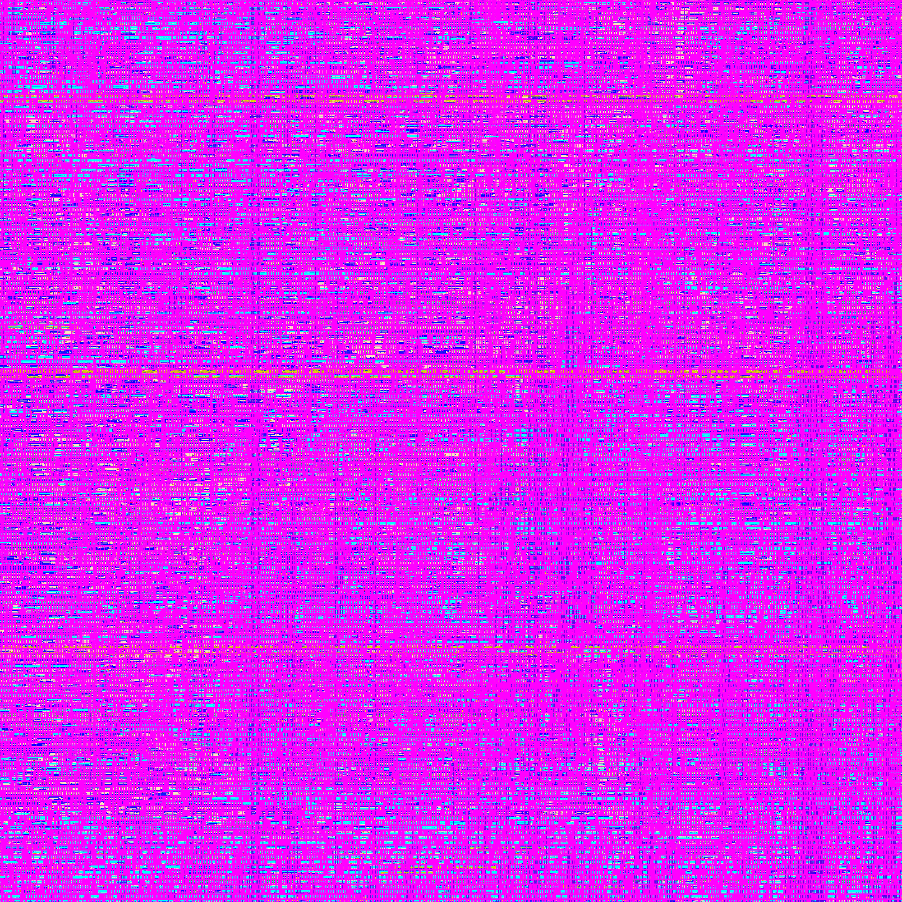
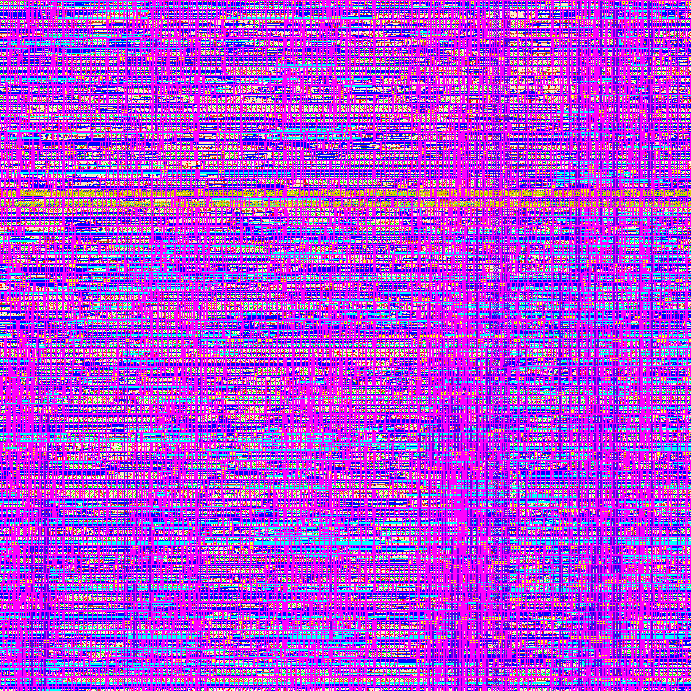
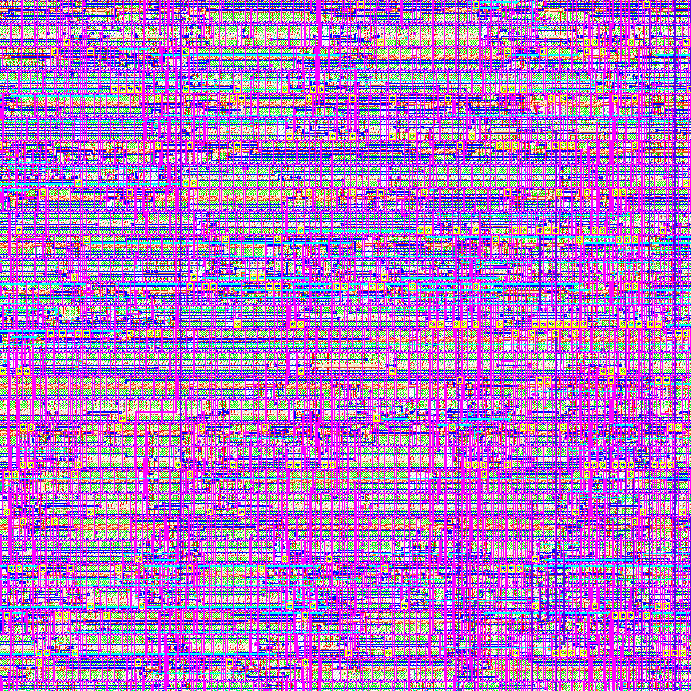
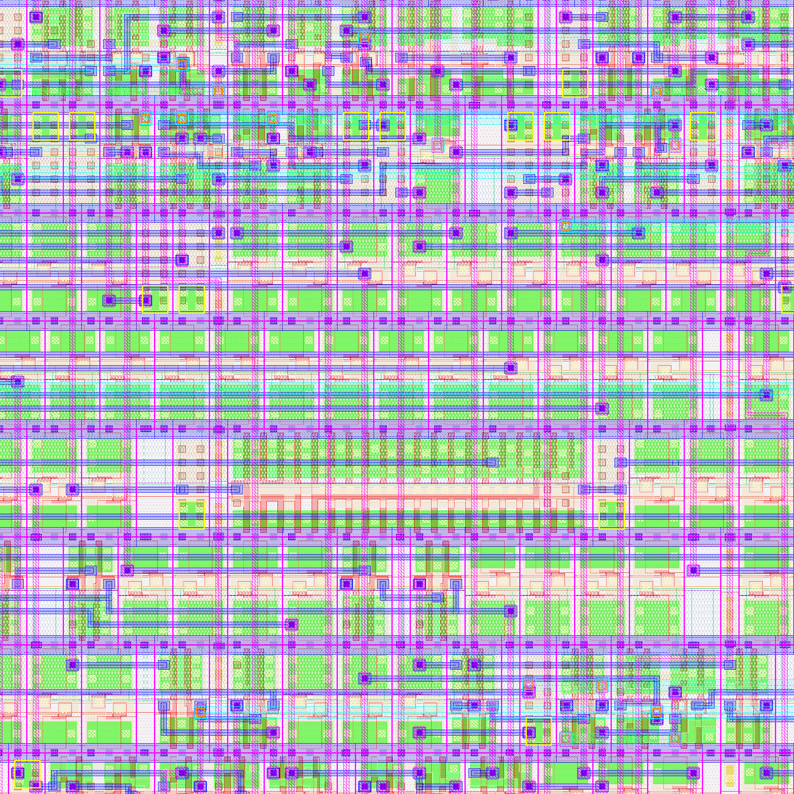
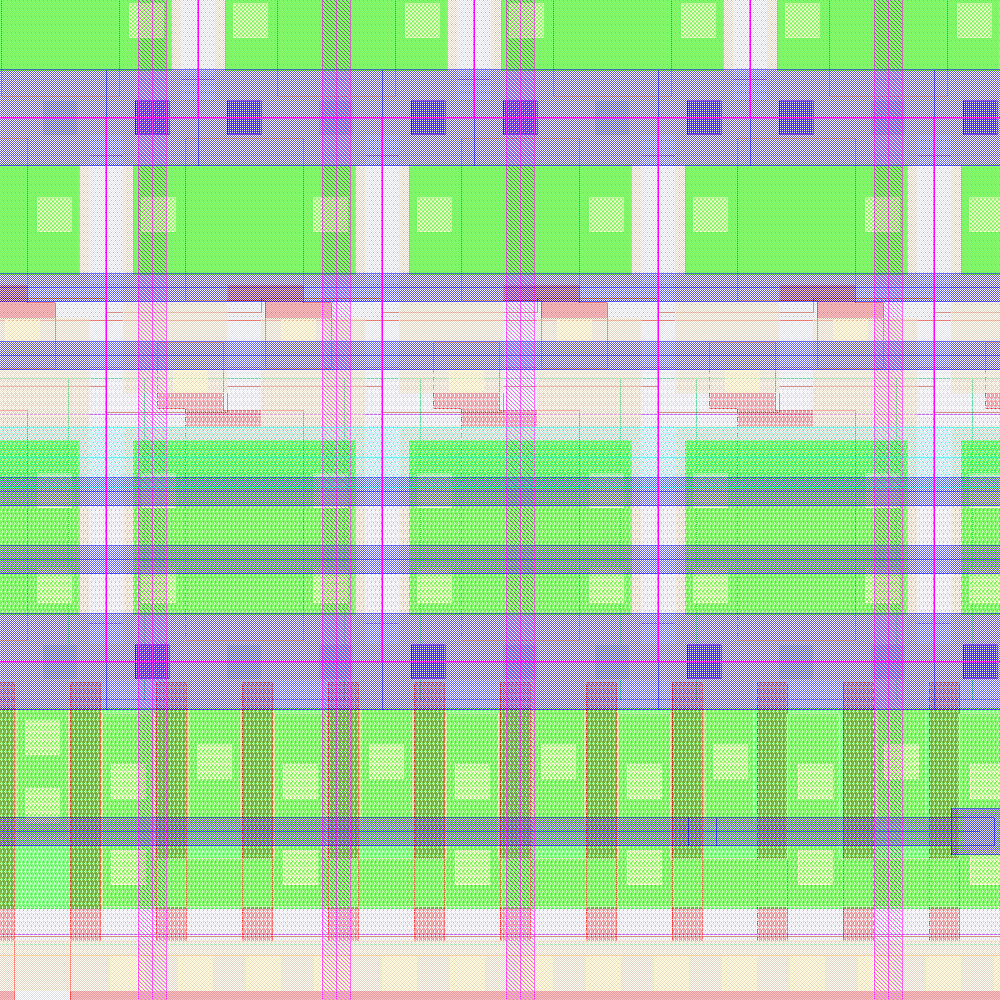

# 32-bit 8-Stage Pipelined Processor — RTL to GDS Signoff

Full RTL-to-GDSII Place-and-Route (PnR) physical implementation of a 32-bit 8-stage pipelined processor using **MY FLOW** on the **SKY130A** open-source PDK.

---

## Signoff Summary

| Check | Result |
|-------|--------|
| Magic DRC | ✅ 0 violations |
| KLayout DRC | ✅ 0 violations |
| LVS (Netgen) | ✅ Circuits match uniquely |
| Antenna | ✅ Pass |
| Hold Timing (all corners) | ✅ Pass |
| IR Drop (VPWR) | ✅ 0.372 mV worst |

---

## Key Metrics

| Metric | Value |
|--------|-------|
| Process | SKY130A (130 nm) |
| Die Area | 2107 × 2118 µm |
| Core Utilization | 51.07% |
| Total Cells | 242,823 devices |
| Nets | 232,718 |
| Total Wirelength | 12,010,550 µm |
| Vias | 2,067,558 |
| Clock Frequency | 40 MHz |
| Power (Total) | 52.75 mW |

---

## PnR Layout Images

| Full Chip | Quadrant Zoom |
|-----------|--------------|
|  |  |

| Block Level | Routing Zoom |
|-------------|-------------|
|  |  |

| Routing Detail | Cell Level | Transistor Level |
|----------------|-----------|-----------------|
|  |  |  |

---

## Repository Structure

```
├── src/                  # RTL source files
├── verif/                # Verification testbenches
├── config.json           # MY FLOW run configuration
├── images/               # PnR layout images (7 zoom levels)
└── output/               # Final PnR signoff outputs
    ├── gds/              # GDS II (primary tape-out format)
    ├── klayout_gds/      # GDS II (KLayout-compatible)
    ├── mag_gds/          # GDS II (Magic-extracted)
    ├── mag/              # Magic layout database
    ├── def/              # Design Exchange Format (post-route)
    ├── odb/              # OpenDB database
    ├── lef/              # Library Exchange Format (abstract)
    ├── nl/               # Gate-level netlist (post-synthesis)
    ├── pnl/              # Physical netlist (post-PnR)
    ├── spice/            # SPICE netlist (extracted)
    ├── spef/             # Parasitics (max / min / nom)
    │   ├── max/
    │   ├── min/
    │   └── nom/
    ├── sdf/              # Standard Delay Format (9 corners)
    │   ├── max_ff_n40C_1v95/
    │   ├── max_ss_100C_1v60/
    │   ├── max_tt_025C_1v80/
    │   ├── min_ff_n40C_1v95/
    │   ├── min_ss_100C_1v60/
    │   ├── min_tt_025C_1v80/
    │   ├── nom_ff_n40C_1v95/
    │   ├── nom_ss_100C_1v60/
    │   └── nom_tt_025C_1v80/
    ├── lib/              # Liberty timing files (9 corners)
    ├── sdc/              # Timing constraints
    ├── vh/               # Verilog header
    ├── render/           # Layout render image
    ├── reports/          # Signoff reports
    │   ├── drc.magic.rpt
    │   ├── drc.klayout.json
    │   ├── lvs.netgen.rpt
    │   ├── sta_summary.rpt
    │   ├── irdrop.rpt
    │   └── manufacturability.rpt
    ├── metrics.json
    └── metrics.csv
```

---

## Flow

- **Tool:** MY FLOW 3.1.0
- **PDK:** SKY130A
- **Total Steps:** 72 (RTL → Synthesis → Floorplan → Placement → CTS → Routing → DRC → LVS → STA → GDS)

---

> Large files (GDS, SPEF, SDF, DEF, ODB, MAG, netlists) are tracked via **Git LFS**.
